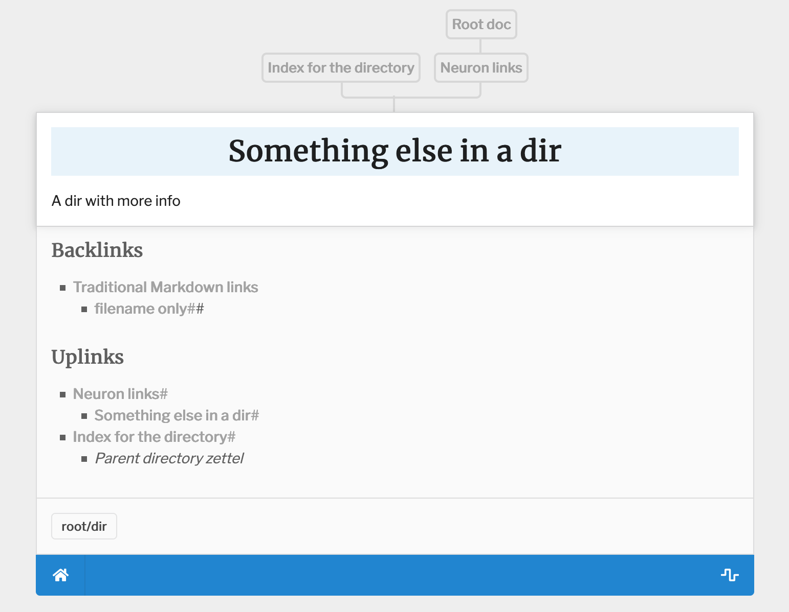

# A reproducible example of directory and uptree plugins not working

Wanted to have an example to add more context to the issue

Issue: https://github.com/srid/neuron/issues/614

The picture describes the problem, that even though the linking between the files was done analogously, the link tree is somewhat weird:


Serve the website locally:
```
$ ./serve.sh
```
